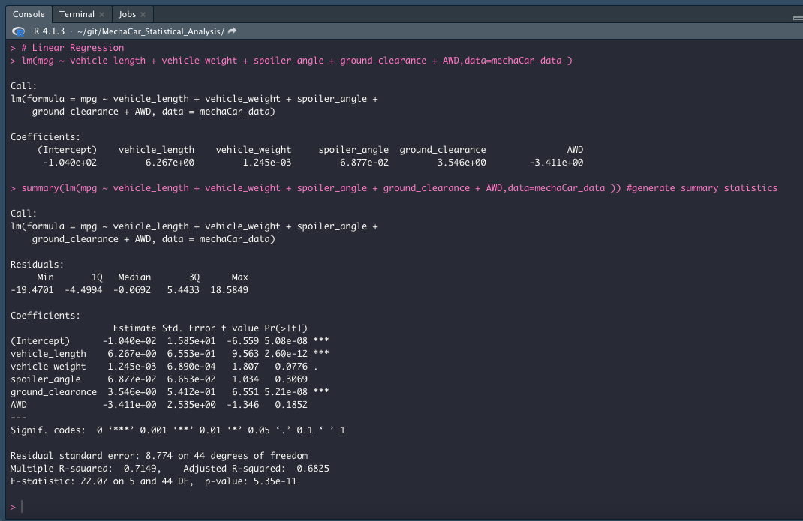
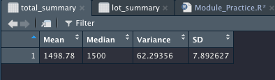
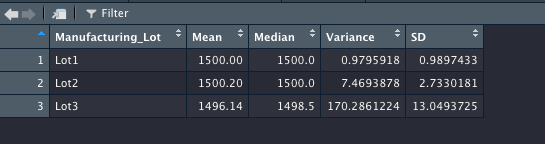
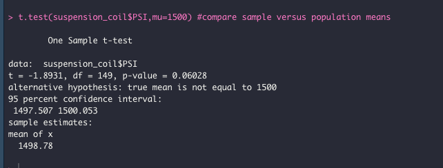
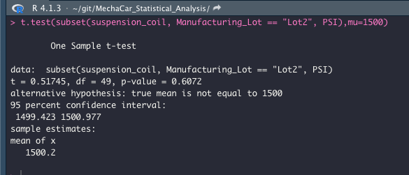
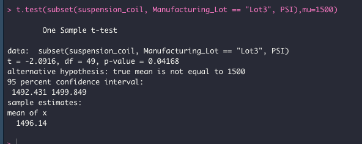

# MechaCar_Statistical_Analysis
## Overview 
For our 15th data analytics project, we use R programing language to perform statistical analysis on a provided data set for MetchCars.  We will perform a Linear Regression test, Summary Statics, a T-Test, and design further tests to perform using options for statistical analysis that we learned in the module.
## Linear Regression to Predict MPG,
The first test we ran is a Linear Regression test in order to see if we can predict Miles Per Gallon of the MechCars Prototypes.  We performed a Multiple Line Linear Regression test using all the fields provided.  Of the variables provided, vehicle_length, vehicle_weight, and ground_clearance provided a non-random amount of variance.

The slope of the linear model is definitely not zero.  With a high r-squared value (0.7149) and a very low p-value (5.35e-11), the regression model points to a high degree of correlation.  A slope of zero would indicate no such correlation.  

I do not think that this model can predict mpg effectively.  This is a very small sample size, so even with an r squared value of 0.7149, it may indicate that we have about a 71% chance of predicting the mpg of the MechaCar prototypes in our data set. There are possibly still other variables to explain the variability of the mpg and we most likely need a larger sample size.  

## Summary Statistics on Suspension Coils
We did a simple summary on the data imported for the Suspension Coils of the MechaCars.  We wanted to make sure that the lots are all withing specifications.  Analyzing the PSI of each coil and summarizing them by lot and for the whole group, we see that the total coils does fall within the specifications, with a variance of only 62.3 psi, however, when we dig into the summary by lots, we see that Lot1 and Lot2 have a very low variance, while Lot3 by itself is actual not within the specification with a 170 psi variance.

## T-Tests on Suspension Coils
For the T-Test results on the total file, at 0.0602, the p-value is just barely above the threshold of being statistically different, considering the threshold of 0.05.       

For the Individual lots.  
Lot 1:
This lot matches exactly the population mean and thus has a p_value of 1.

Lot 2:
This lot still has a very high p_value (0.6072), indicating it is also not statistically different.

Lot 3:
This lot however has a p_value of 0.04168, which is lower than the 0.05 significance.  Therefore it is actually statically different than the population mean of 1500 psi.

## Study Design: MechaCar vs Competition
For the additional statistical study, I'm going to suggest a comparison of mpg for each car class between the MechaCars and the Mean mpg for each class across the industry.  To do so, I suggest using a Paired T-Test for each car class to compare MPG.  

My Null Hypothesis Ho is that for the paired observations of mpg of Mecha cars for each car class and the mpg of the observed mpg of the rest of the competition, that the statistical difference between true mean difference in the mpg of MechaCars vs the rest of the competition is zero.  
The Alternative Hypothesis Ha, is that we will see a statistically significant difference between the paired observations of MechaCars and the rest of the competition that is not equal to zero for each car class.  We will also use the "Greater" argument since we are concerned with MechaCars being better than the competition not worse.  This test would allow us to gain an indication if MechaCars truly have a statistically significant higher mpg by car class than the competition. 
To do this, we will need to have a dataset that includes enough MechaCars per car class to be relevant, the type of those cars, and the observed mpg for each car.  As well, we would need to have the same data for car manufacture, with the car type classification and the observed mpg.  
A note on how the mpg for each car was obtained is important as well.  For the test to be relevant, the data should be based on the same amount of city vs hwy miles, and the amount of miles driven for each car should also be high enough to get a valid statistical test.   