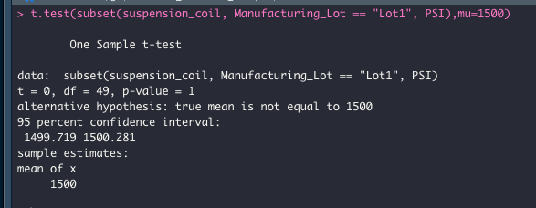

# MechaCar_Statistical_Analysis
## Overview 
For our 15th data analytics project, we use R programing language to perform statistical analysis on a provided data set for MetchCars.  We will perform a Linear Regression test, Summary Statics, a T-Test, and design further tests to perform using options for statistical analysis that we learned in the module.
## Linear Regression to Predict MPG,
The first test we ran is a Linear Regression test in order to see if we can predict Miles Per Gallon of the MechCars Prototypes.  We performed a Multiple Line Linear Regression test using all the fields provided.  Of the variables provided, vehicle_length, vehicle_weight, and ground_clearance provided a non-random amount of variance.

The slope of the linear model is definitely not zero.  With a high r-squared value (0.7149) and a very low p-value (5.35e-11), the regression model points to a high degree of correlation.  A slope of zero would indicate no such correlation.  

The r squared value indicates that we have about a 71% chance of predicting the mpg of the MechaCar prototypes. There are possibly still other variables to explain the variability of the mpg or we may need a larger sample size.

## Summary Statistics on Suspension Coils
We did a simple summary on the data imported for the Suspension Coils of the MechaCars.  We wanted to make sure that the lots are all withing specifications.  Analyzing the PSI of each coil and summarizing them by lot and for the whole group, we see that the total coils does fall within the specifications, with a variance of only 62.3 psi, however, when we dig into the summary by lots, we see that Lot1 and Lot2 have a very low variance, while Lot3 by itself is actual not within the specification with a 170 psi variance.

## T-Tests on Suspension Coils
For the T-Test results on the total file, at 0.0602, the p-value is just barely above the threshold of being statistically different, considering the threshold of 0.05.       

For the Individual lots.  
Lot 1:
This lot matches exactly the population mean and thus has a p_value of 1.

Lot 2:
This lot still has a very high p_value (0.6072), indicating it is also not statistically different.

Lot 3:
This lot however has a p_value of 0.04168, which is lower than the 0.05 significance.  Therefore it is actually statically different than the population mean of 1500 psi.

